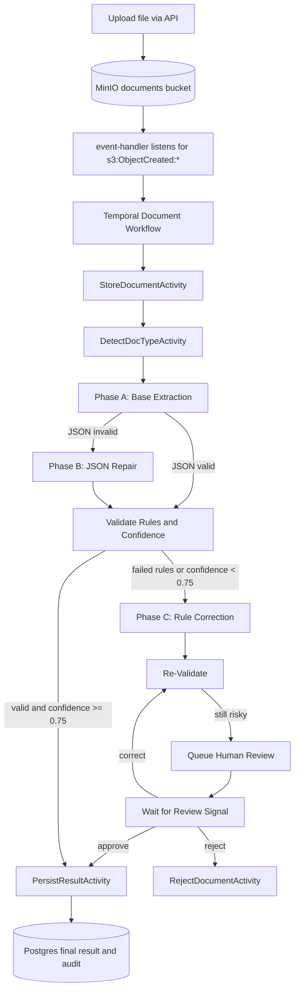

# Storytelling Flow

## What This Is

This project takes a raw document (for example, payslip or invoice), extracts structured fields, validates quality, and only auto-completes when confidence is good.

If confidence is not good, it routes to human review.

## How It Works (Big Picture)

```text
Upload document via API
  -> API writes object to MinIO bucket
  -> MinIO emits ObjectCreated event
  -> event-handler starts Temporal workflow
  -> workflow runs in worker
  -> Store + classify
  -> Phase A (extract)
  -> if broken JSON: Phase B (repair)
  -> validate rules + confidence
  -> if needed: Phase C (correct values)
  -> if still risky: human review loop
  -> final result persisted
```

Architecture diagram:



Workflow orchestration entrypoint:

- `internal/temporal/workflows.go`

## Where LLM Comes Into Picture

LLM is used only in activity code (not workflow code) for non-deterministic tasks:

- extraction
- JSON repair
- rule-based correction

Files:

- `internal/temporal/activities.go`
- `internal/openai/client.go`
- `internal/openai/prompts.go`

## What LLM Does In Each Phase

1. Phase A: Extract
- Prompts: `BASE_SYSTEM`, `BASE_USER_TEMPLATE`
- Goal: pull structured fields from document text.

2. Phase B: Repair
- Prompts: `REPAIR_SYSTEM`, `REPAIR_USER_TEMPLATE`
- Trigger: A output is invalid JSON or schema mismatch.
- Goal: return valid schema-matching JSON only.

3. Phase C: Correct
- Prompts: `CORRECT_SYSTEM`, `CORRECT_USER_TEMPLATE`
- Trigger: validation failed or confidence `< 0.75`.
- Goal: correct only fields needed to satisfy rules.

Prompt constants are in:

- `internal/openai/prompts.go`

## Where Activities Are

All activities are in:

- `internal/temporal/activities.go`

Main activities in order:

1. `StoreDocumentActivity`
2. `DetectDocTypeActivity`
3. `ExtractFieldsWithOpenAIActivity` (A/B/A retry ladder)
4. `ValidateFieldsActivity`
5. `CorrectFieldsWithOpenAIActivity` (C)
6. `QueueReviewActivity` + signal loop
7. `PersistResultActivity` or `RejectDocumentActivity`

## Sample: Workflow Calling Activities

```go
// internal/temporal/workflows.go
var extracted ExtractFieldsOutput
err := workflow.ExecuteActivity(
  ctxExtractFields,
  (*Activities).ExtractFieldsWithOpenAIActivity,
  ExtractFieldsInput{DocumentID: input.DocumentID, DocType: detected.DocType, DocumentText: stored.DocumentText},
).Get(ctx, &extracted)
```

## Sample: Where LLM Is Called

```go
// internal/temporal/activities.go
out, err := a.LLM.CompleteJSON(ctx, openai.CompletionRequest{
  Model:        a.OpenAIModel,
  SystemPrompt: systemPrompt,
  UserPrompt:   userPrompt,
  Timeout:      a.OpenAITimeout,
})
```

## Sample: LLM Retry Policy In Activity

```go
// internal/temporal/activities.go
for attempt := 1; attempt <= maxRetry; attempt++ {
  out, err := a.LLM.CompleteJSON(...)
  if err == nil {
    return out, nil
  }
  delay := time.Duration(200*(1<<(attempt-1))) * time.Millisecond
  time.Sleep(delay)
}
```

Related policy setup:

- activity-level OpenAI retry: `callOpenAIWithRetry` in `internal/temporal/activities.go`
- per-activity Temporal retry options: `internal/temporal/activity_policies.go`

## Sample: Prompt Usage

```go
// internal/openai/prompts.go
const BASE_SYSTEM = `You are a document information extraction engine...`
const REPAIR_SYSTEM = `You are a strict JSON repair engine...`
const CORRECT_SYSTEM = `You are a document extraction correction engine...`
```

Prompt builders:

- `BuildBaseUserPrompt(...)`
- `BuildRepairUserPrompt(...)`
- `BuildCorrectUserPrompt(...)`

## Testing Confidence And Quality

There are 3 layers of confidence/quality testing.

1. Unit tests
- validation rules (`internal/domain/validation_test.go`)
- prompt rendering (`internal/openai/prompts_test.go`)
- strict parsing (`internal/openai/parse_test.go`)

2. Activity-level tests
- invalid JSON repaired by Phase B:

```go
// internal/temporal/activities_test.go
llm := &stubLLM{responses: []string{
  `{"employee_name":"Jane"`,
  `{"employee_name":"Jane","employer_name":"ACME",...,"confidence":0.9}`,
}}
out, err := acts.ExtractFieldsWithOpenAIActivity(...)
require.NoError(t, err)
require.Equal(t, 0.9, out.Confidence)
```

3. System blackbox test (real infra)
- uploads through API, submits review through API, then validates workflow history via Temporal SDK client:

```go
// tests/system/blackbox_system_happy_path_test.go
upload, err := uploadFile(apiBaseURL, filePath)
Expect(err).ToNot(HaveOccurred())

reviewAck, err := submitReviewDecision(apiBaseURL, upload.DocumentID, domain.ReviewDecisionApprove, "system-blackbox")
Expect(err).ToNot(HaveOccurred())
Expect(reviewAck.Status).To(Equal("review_signal_sent"))

trace, err := collectActivityTrace(context.Background(), temporalClient, upload.WorkflowID)
Expect(err).ToNot(HaveOccurred())
Expect(trace.CompletedOrder).To(Equal(cfg.ExpectedActivityOrder))
```

## Why Braintrust Is Used

Braintrust is used to evaluate production behavior continuously, not just unit logic.

It gives you:

- field-level accuracy scoring
- schema conformance scoring
- confidence-threshold scoring
- review-avoidance metric
- experiment history and comparison in UI

Go eval harness location:

- `evals/braintrust/main.go`

## Sample: Braintrust Evaluator Setup

```go
// evals/braintrust/main.go
result, err := evaluator.Run(ctx, eval.Opts[evalInput, evalOutput]{
  Experiment: cfg.Experiment,
  Dataset:    eval.NewDataset(cases),
  Task:       eval.T(runner.runCase),
  Scorers: []eval.Scorer[evalInput, evalOutput]{
    eval.NewScorer("status", scoreStatus),
    eval.NewScorer("field_accuracy", scoreFieldAccuracy),
    eval.NewScorer("confidence_threshold", scoreConfidenceThreshold),
  },
})
```

## Where To See What

Use this as your "what happened and where do I check" map during runs.

Local URLs:

- API: `http://localhost:8080`
- Temporal UI: `http://localhost:8233`
- MinIO API: `http://localhost:9000`
- MinIO Console: `http://localhost:9001` (login `minioadmin` / `minioadmin`)

Phase-by-phase checks:

1. Upload started
- Call `POST /v1/documents` with a file.
- Response gives `document_id` and `workflow_id`.
- This means intake was accepted and object was written to MinIO.
- Workflow start happens asynchronously when `event-handler` receives MinIO `ObjectCreated` notification.

2. Workflow progress
- Poll `GET /v1/documents/{documentId}/status`.
- Status moves through states like `STORED`, `CLASSIFIED`, `EXTRACTED`, `NEEDS_REVIEW`, `COMPLETED`, `REJECTED`.
- In Temporal UI, open workflow `doc-intake-{documentId}` to see activity execution order and retries.

3. What LLM produced in A, B, C
- Query `extraction_attempts` table to see raw outputs saved per phase.
- Example:

```sql
SELECT phase, output, created_at
FROM extraction_attempts
WHERE document_id = 'YOUR_DOCUMENT_ID'
ORDER BY created_at;
```

4. Why status changed
- Query `audit_log` table for state transitions and detail payload.
- Example:

```sql
SELECT state, detail, created_at
FROM audit_log
WHERE document_id = 'YOUR_DOCUMENT_ID'
ORDER BY created_at;
```

5. Human review queue
- Call `GET /v1/reviews/pending` for pending items.
- Or query DB table `review_queue`.
- Send review decision with `POST /v1/documents/{documentId}/review` using `approve`, `reject`, or `correct`.

6. Final output for consumers
- Call `GET /v1/documents/{documentId}/result`.
- Returns final `status`, `doc_type`, `confidence`, and extracted `result` JSON.

7. Stored source file
- In MinIO Console, open bucket `documents`.
- You can inspect uploaded object keys and verify the source artifact exists.

8. Evaluation report
- Run `make eval-braintrust` or `make eval-braintrust-docker`.
- The evaluator prints `Braintrust report: <url>` when the run completes.
- Open that URL to see scorer results like `field_accuracy`, `schema_conformance`, `validation_rules`, and `confidence_threshold`.

## Final Mental Model

- LLM suggests data.
- System verifies data.
- Human decides only when confidence is still not safe.

That is the core design of this project.
